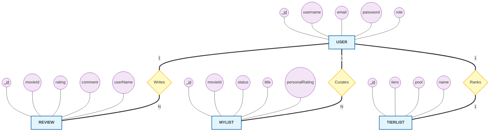

# RankMyList - Chen's ER Model

This diagram uses the classic **Chen's Notation** to represent the logical structure of the database.

---

## 🧭 Legend of Symbols

| Shape | Meaning | Example in Diagram |
| :--- | :--- | :--- |
| **Rectangle** | **Entity**: A major object or "thing" in the system. | `USER`, `REVIEW` |
| **Diamond** | **Relationship**: How two entities connect or interact. | `Writes`, `Curates` |
| **Oval** | **Attribute**: A property or data field of an entity. | `email`, `rating` |
| **Double Oval** | **Multi-valued Attribute** | (e.g., if a user had multiple phone numbers) |
| **Underlined** | **Primary Key**: The unique identifier for the record. | `_id` |

---

## 📈 Relationship Summary

1.  **User Writes Review (1:N)**: A single user can author many reviews, but each review is tied to one specific user.
2.  **User Curates MyList (1:N)**: A user maintains a collection of "Watched" or "Plan to Watch" entries. Each entry is a unique record.
3.  **User Ranks TierList (1:1)**: Every user gets one personalized movie ranking board to organize their top picks.
