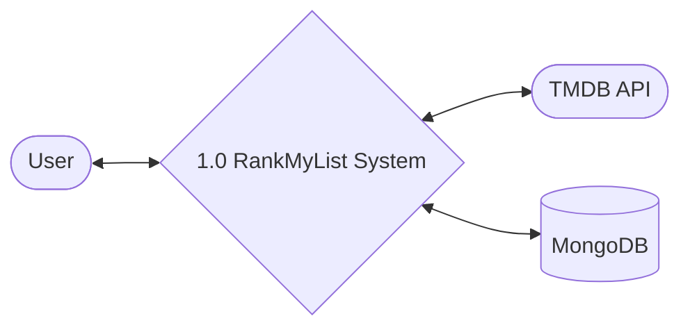
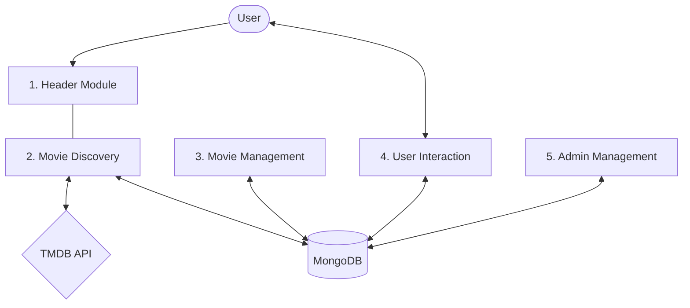
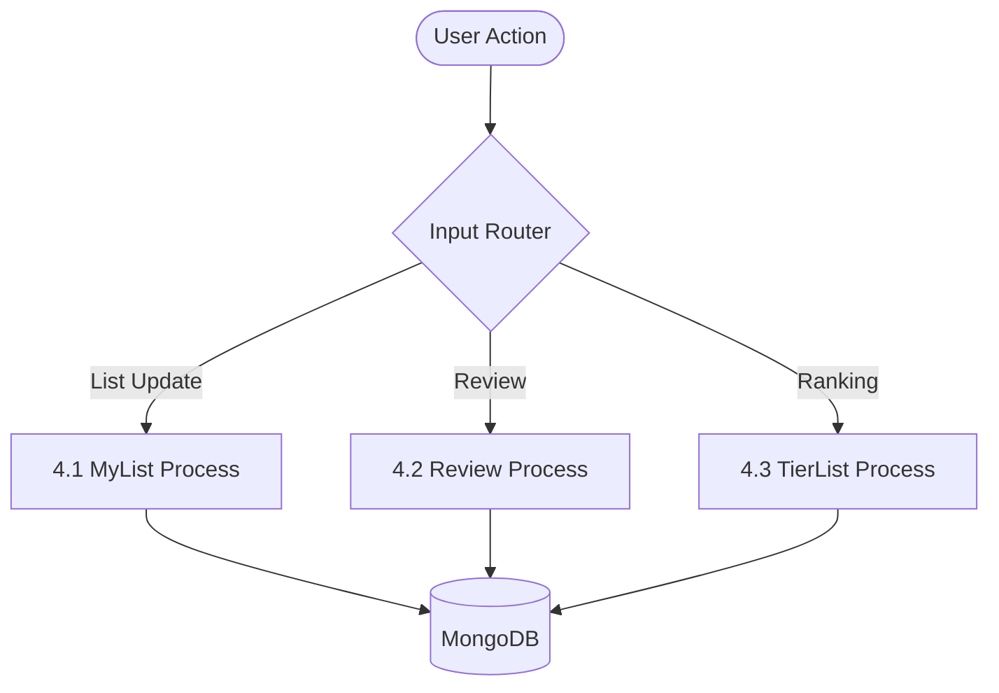
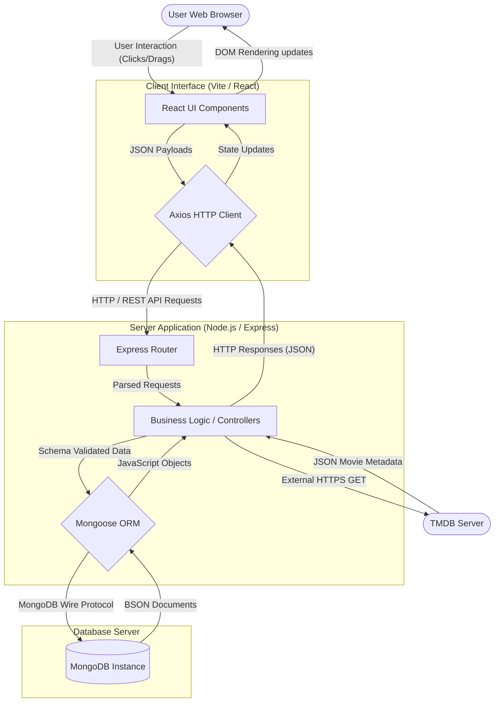

# Data Flow Diagrams (DFD) - RankMyList

This document summarizes the flow of data through the RankMyList application using the five core functional modules in a simplified, text-based format.

---

## 🌐 Level 0: Context Diagram
The Context Diagram represents the entire system as a single process interacting with external entities.

### High-Level Flows:
- **User ➔ System**: Authentication, Movie Actions (Lists/Reviews), Search Queries.
- **System ➔ User**: Recommendations, Search Results, Auth Tokens.
- **TMDB API ➔ System**: Movie/TV Metadata.

---

## 🏗️ Level 1: Structural Diagram
The Level 1 DFD breaks the system into its primary functional modules and their interactions with data stores.

### Module Descriptions:
1.  **1. Header Module**: Handles navigation and session state routing.
2.  **2. Movie Discovery**: Orchestrates TMDB API metadata and recommends films.
3.  **3. Movie Management**: Facilitates manual catalog entries and content curation.
4.  **4. User Interaction**: Processes personal ratings, reviews, and tier rankings.
5.  **5. Admin Management**: Monitors stats and moderates system data.

---

## 🔍 Level 2: Detailed Flow (User Interaction)
Deep dive into the data transformation when a user interacts with a movie.

### Logical Steps:
- **4.1 MyList**: Updates the `mylists` collection based on "Watched" or "Plan to Watch" status.
- **4.2 Review**: Persists textual feedback and numerical ratings to the `reviews` collection.
- **4.3 TierList**: Commits visual ranking board states to the `tierlists` collection.

---

## 🖥️ Physical DFD
Unlike the logical diagrams above which show *what* happens, the Physical DFD shows *how* it is implemented using specific technologies, protocols, and hardware/software boundaries.

### Physical Implementation Details:
- **Client Side**: Uses a modern web browser to render the local Vite/React build. All state is maintained locally and synced via asynchronous HTTP requests.
- **Network Layer**: Uses Axios to manage all RESTful interactions over HTTP (port 5000 in dev) passing JSON data.
- **Server Side**: A Node.js environment running an Express application. It handles routing, middleware (JWT auth), and interfaces with external/internal systems.
- **Database Layer**: MongoDB handles persistent data storage locally or via a cloud cluster (like MongoDB Atlas), queried using Mongoose schemas.
- **External API**: Communicates securely over HTTPS to The Movie Database (TMDB) to fetch live metadata, ensuring the local database isn't bloated with static movie details.
