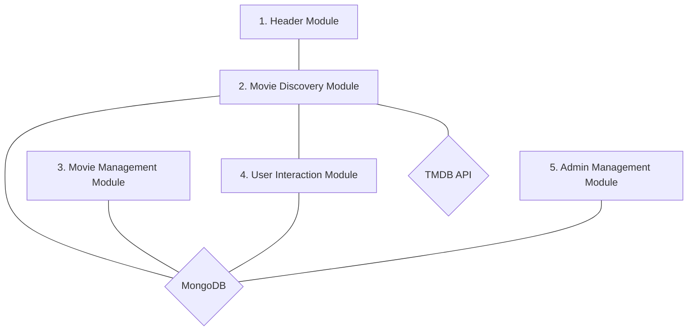
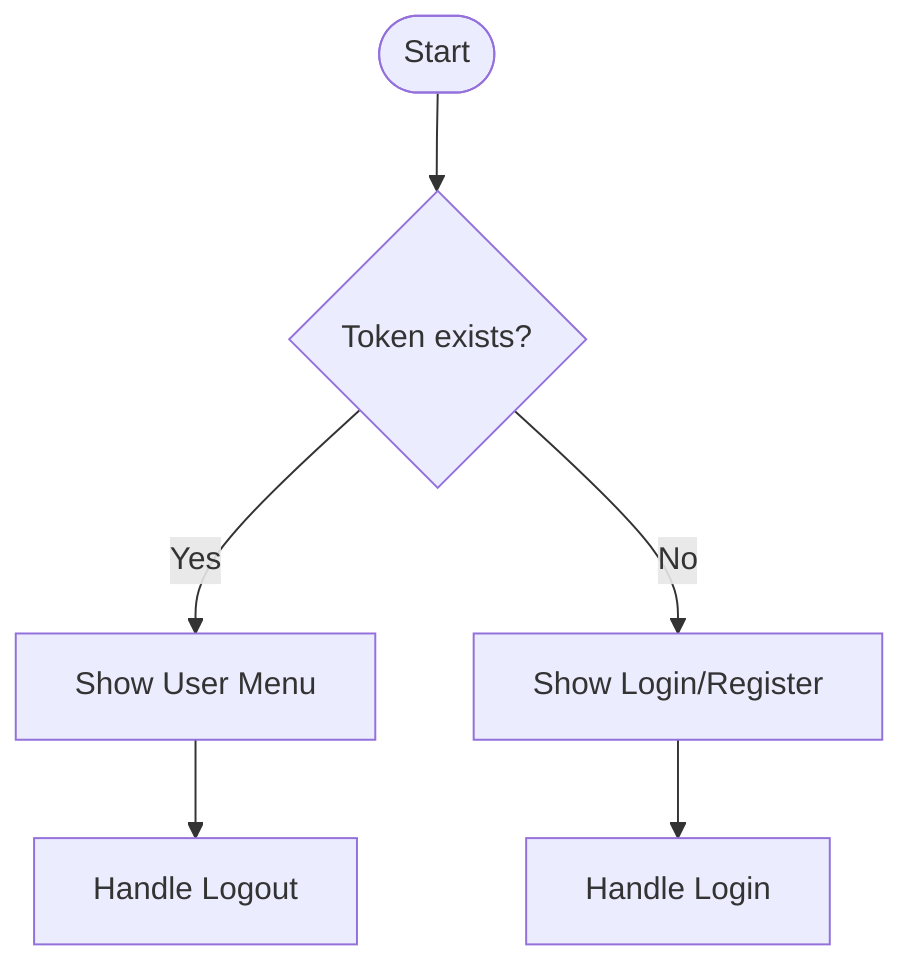
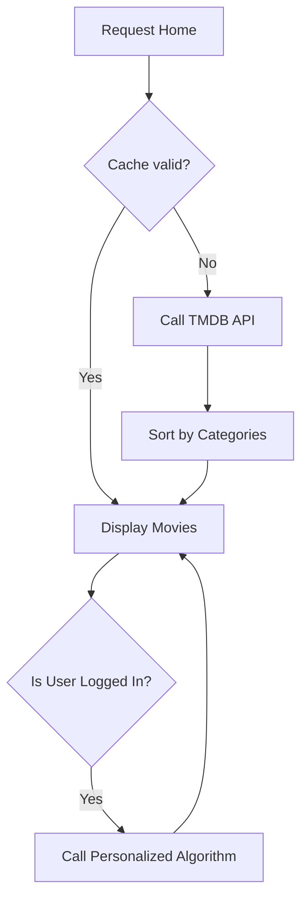
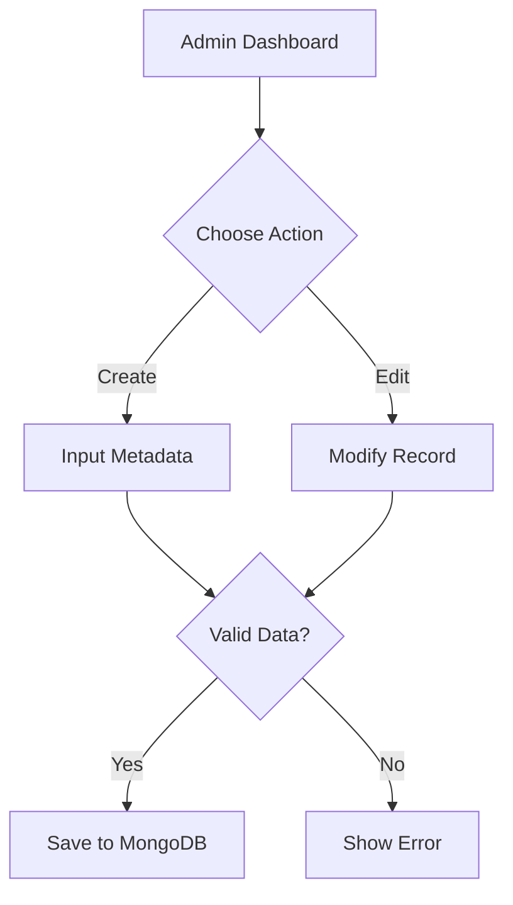
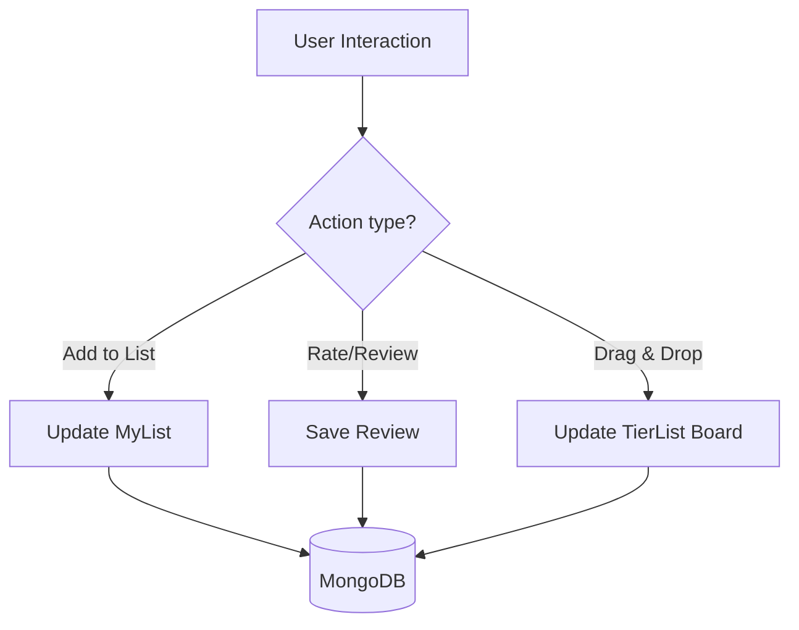
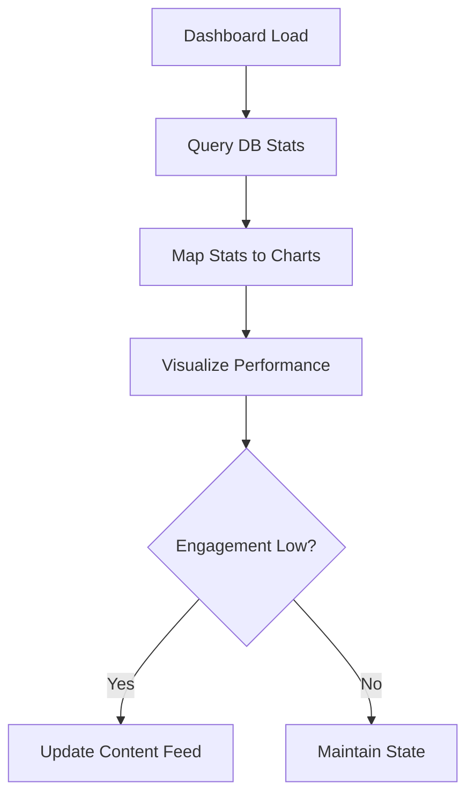

# Module Implementation Details - Rank My List

This document outlines the core functional modules of the **Rank My List** platform, detailing their purpose, key features, and technical specifications.

---

## 🏗️ System Architecture Diagram

---

## 📋 Functional Modules

### 1. Header Module
Displays the header section with the platform's logo and navigation menu. It provides quick access to core sections like **Home**, **Search**, **My List**, and **Tier List**. The module ensures consistent navigation and authentication state (Login/Logout) across all pages of the application.

### 2. Movie Discovery & Recommendation Module
Displays organized movie resources and discovery tools. It categorizes content into curated categories such as **"Hidden Gems"**, **"Top Rated Classics"**, and **"Recent Hits"**. This module integrates the **"For You"** personalized recommendation engine, which suggests films based on the user's personal rating history. A robust search functionality is available for efficient access to the global movie database.

### 3. Movie & Content Management Module
Facilitates database management by enabling administrators to manage the movie catalog. This includes:
- **Manual Movie Entry**: Uploading and editing custom movie records directly into the local database.
- **Categorization**: Organizing content based on genres, release dates, and curated collection tags.
- **Metadata Management**: Providing an interface for managing and updating movie descriptions, ratings, and poster assets.

### 4. User Interaction & Ranking Module
Enhances the user experience by enabling personalized content organization and engagement. Key features include:
- **My List Management**: Categorizing movies into "Watched" or "Plan to Watch" status for easy tracking.
- **Personalized Ranking**: An interactive **Tier List Creator** that allows users to visually rank movies into tiers (S, A, B, C, D) using drag-and-drop mechanics.
- **Reviews & Ratings**: Providing users with the ability to write detailed reviews and assign personal ratings to seen content.

### 5. Admin Management & Analytics Module
Supports administrative operations for content moderation and platform oversight. It includes a comprehensive **Admin Dashboard** to:
- **Monitor Engagement**: Track platform statistics such as total user growth, review counts, and movie popularity.
- **Content Moderation**: Review and update user-generated content and local movie metadata ensuring alignment with platform quality standards.
- **System Monitoring**: Tracking resource performance and ensuring the stability of the TMDB API integrations.

---

## 🛠️ Technical Specification

### 1. Header Module (Frontend)
- **Primary Component**: `frontend/src/components/Navbar.jsx`
- **Routing Integration**: `frontend/src/App.jsx` (React Router v7)
- **Authentication State**: Managed via `localStorage` and `useEffect` hooks to toggle between Guest and User views.

### 2. Movie Discovery & Recommendation Module (Fullstack)
- **Frontend Pages**: `frontend/src/pages/Home.jsx`, `frontend/src/pages/ForYouPage.jsx`, `frontend/src/pages/Search.jsx`
- **Backend Controller**: `backend/src/controllers/suggestionController.js`
- **External Integration**: TMDB API (The Movie Database)
- **Logic**: Uses user-rated movies from MongoDB to query TMDB's `similar` endpoint for the "For You" algorithm.

### 3. Movie & Content Management Module (Backend + Admin UI)
- **Backend Model**: `backend/src/models/Movie.js`
- **Backend Routes**: `backend/src/routes/adminRoutes.js` (POST, PUT, DELETE `/admin/movie`)
- **Admin Interface**: `frontend/src/pages/AdminDashboard.jsx` (Movie Management tab)
- **Feature**: Supports CRUD operations for movies not available through standard TMDB searches.

### 4. User Interaction & Ranking Module (Fullstack)
- **Frontend Pages**: `frontend/src/pages/MyListPage.jsx`, `frontend/src/pages/TierListPage.jsx`
- **Backend Models**: `backend/src/models/MyList.js`, `backend/src/models/TierList.js`, `backend/src/models/Review.js`
- **Interactivity**: Powered by `@dnd-kit` for drag-and-drop ranking in the Tier List module.
- **State Management**: Real-time updates to MongoDB when a movie's status or rank changes.

### 5. Admin Management & Analytics Module (Admin Dashboard)
- **Backend Routes**: `backend/src/routes/adminRoutes.js` (GET `/admin/dashboard`)
- **Data Aggregation**: Mongoose `.countDocuments()` and `.find().sort()` queries to generate real-time platform stats.
- **Moderation Tools**: User management and Review deletion tools found in the `AdminDashboard.jsx` interface.

---

## 🔐 Security & Authentication Module

The application implements a multi-layered security approach to protect user data and administrative functions.

### 1. Token-Based Authentication
- **Technology**: JSON Web Token (JWT).
- **Process**: Upon successful login (`authController.js`), a token is generated containing the user's ID and role, then stored in the browser's `localStorage`.
- **Validation**: Every protected API request includes the token in the `Authorization: Bearer <token>` header.

### 2. Middleware Architecture (`backend/src/middleware/`)
- **`authMiddleware.js`**: Intercepts requests to verify the JWT. Decodes the token and attaches the user data to the `req.user` object for downstream use.
- **`adminMiddleware.js`**: Checks the `req.user.role` field. If the role is not `admin`, it returns a `403 Forbidden` response, preventing unauthorized access to sensitive management routes.

---

## 📡 API Endpoint Reference

### 👤 Authentication
- `POST /auth/register`: Creates a new user profile.
- `POST /auth/login`: Authenticates user and returns JWT.

### 🎞️ Movie Discovery
- `GET /suggestions/curated`: Fetches pre-defined categories (Hidden Gems, etc.).
- `GET /suggestions/personalized`: Fetches "For You" picks based on user rating seeds.
- `GET /suggestions/category/:id`: Fetches paginated details for a specific category.

### 📋 List & Ranking
- `GET /mylist`: Retrieves the current user's movie list.
- `POST /mylist/add`: Adds a movie to the user's list.
- `POST /tierlist/save`: Persists a user's custom tier ranking configuration.

### 🛠️ Admin Operations
- `GET /admin/dashboard`: Returns aggregate statistics and recent user data.
- `POST /admin/movie`: Manually creates a new movie entry.
- `DELETE /admin/user/:id`: Removes a user and their associated data (cascading cleanup).

---

## 💾 Data Models & Persistence

The platform uses five primary MongoDB collections managed via Mongoose schemas.

### 1. User (`usersignup.js`)
Stores authentication credentials and profile information.
- **Key Fields**: `username`, `email`, `password`, `role` (admin/user).

### 2. MyList (`MyList.js`)
Tracks the relationship between users and movies they've interacted with.
- **Key Fields**: `user` (ref), `movieId` (TMDB ID), `status` (watched/plan_to_watch), `personalRating`.

### 3. TierList (`TierList.js`)
Stores the visual ranking state of a user's collection.
- **Key Fields**: `tiers` (S, A, B, C, D arrays of movie objects), `pool` (candidate movies).

### 4. Review (`Review.js`)
Stores user-generated textual feedback and numerical ratings.
- **Key Fields**: `user` (ref), `movieId`, `rating` (1-10), `comment`.

### 5. Movie (`Movie.js`)
A local cache and management store for admin-added movies.
- **Key Fields**: `title`, `overview`, `posterPath`, `genres`, `customAddedByAdmin`.

---

## 🔍 Detailed Module Logic

This section breaks down the internal logic of each module using simplified flowchart notation.

### 1. Header Module Logic

### 2. Movie Discovery & Recommendation Logic

### 3. Movie & Content Management (Admin)

### 4. User Interaction & Ranking

### 5. Admin Management & Analytics

---

## 📂 Directory & File Structure

The project is structured to maintain a clear separation between the 5 functional modules as shown below:

### 📱 Frontend (React)
- `frontend/src/components/` ➔ **1. Header Module** (Navbar.jsx)
- `frontend/src/pages/` ➔ **2. Movie Discovery** (Home.jsx, Search.jsx, ForYouPage.jsx)
- `frontend/src/pages/` ➔ **4. User Interaction** (MyListPage.jsx, TierListPage.jsx, MovieDetails.jsx)
- `frontend/src/pages/` ➔ **5. Admin Management** (AdminDashboard.jsx)

### ⚙️ Backend (Node.js)
- `backend/src/controllers/` ➔ **2. Discovery Logic** (suggestionController.js)
- `backend/src/controllers/` ➔ **4. Interaction Logic** (myListController.js, tierListController.js, reviewController.js)
- `backend/src/routes/` ➔ **5. Admin Logic** (adminRoutes.js)
- `backend/src/models/` ➔ **Data Persistence** (All .js models)

---

## 🛠️ System Configuration & Error Handling

### 🧩 Environment Variables
The application relies on synchronized environment variables for cross-module communication.
- **Backend (.env)**: `PORT`, `MONGO_URI`, `JWT_SECRET`, `TMDB_API_KEY`.
- **Frontend (.env)**: `VITE_API_URL` (points to the backend address).

### 🛡️ Error Handling Strategies
- **Global Error Handling**: The backend uses centralized standard HTTP status codes (400, 401, 403, 404, 500) with descriptive JSON messages.
- **Frontend Feedback**: `react-hot-toast` provides real-time, non-intrusive alerts to the user for events like "Movie Added", "Login Failed", or "Session Expired".
- **API Fallbacks**: In the `suggestionController.js`, many API calls are wrapped in `try/catch` blocks that return empty arrays or cached "Trending" content if the external TMDB service becomes unavailable, ensuring the UI remains stable.
