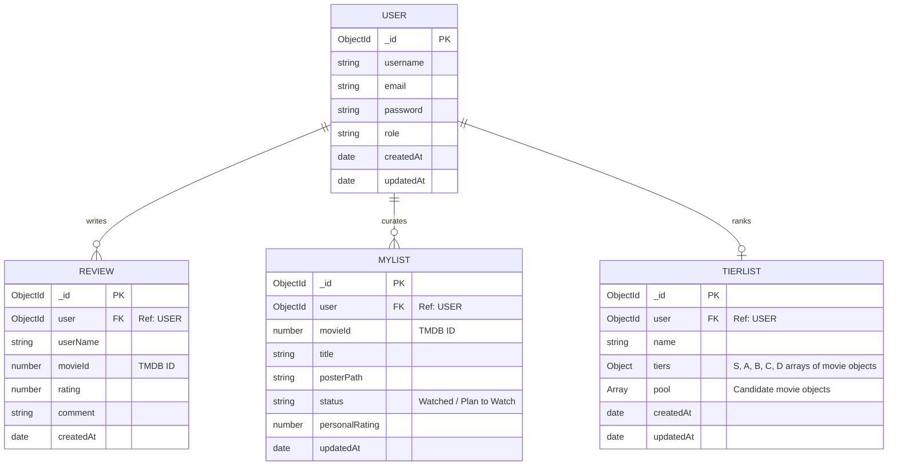

# RankMyList ER Diagram

This diagram outlines the core data models and their relationships in the project's MongoDB database.

## Description of Relationships

### 1. User & Reviews (1:N)
Each user can write multiple reviews, but each review is mapped to exactly one user through the `user` reference field. Note that we also cache the `userName` in the Review document for quick display.

### 2. User & MyList (1:N)
Users maintain a personal library of movies they've watched or plan to watch. Each movie entry is unique per user (enforced by a composite index).

### 3. User & TierList (1:1)
While the schema supports multiple, the current implementation maintains a single persistent "Default" ranking board per user to keep the experience focused and effortless.

### 4. Global Identifier
All models use the **TMDB Movie ID** (`movieId`) as the primary key for identifying content across the system. This allows us to sync data between the custom backend and the external Movie Database API without storing duplicates of all movie metadata.
